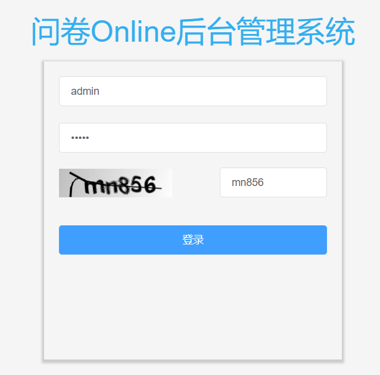
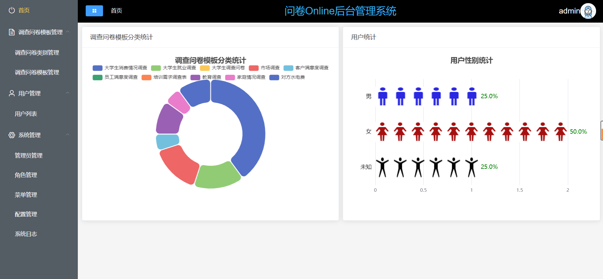
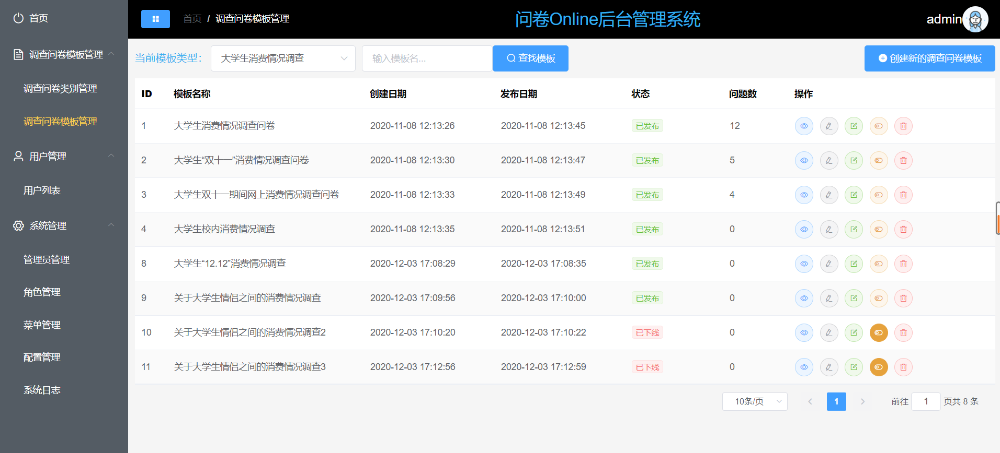
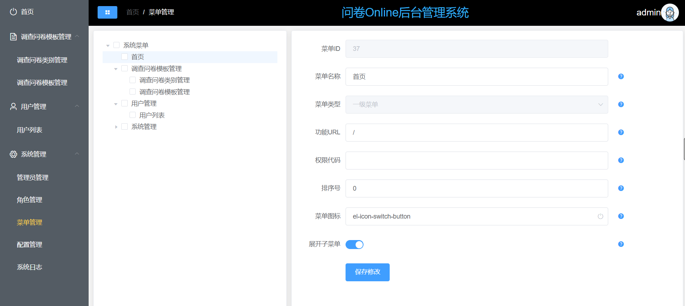

# 问卷Online后台管理系统

## 项目介绍

该项目是问卷调查项目《问卷Online》Web APP的管理后台实现，它是一个后台管理系统。采用前后端分离架构。
<br>

- 该系统对应的前端项目[《questionnaire-admin-web》点击进入](https://github.com/cloudgyb/questionnaire-admin-web)
- 《问卷Online》Web APP[《questionnaire》点击进入](https://github.com/cloudgyb/questionnaire)

**主要功能**

- 后台用户登录
- 调查问卷模板管理功能
- 《问卷Online》Web APP的用户管理
- 系统管理
    + 系统菜单和权限管理
    + 用户角色管理
    + 系统用户管理
    + 系统日志管理
    + 系统配置管理

**项目特点**

- 采用前后端分离开发模式，通过token进行数据交互
- 灵活的权限控制，可控制到页面或按钮，满足绝大部分的权限需求
- 使用Hibernate Validator校验框架，轻松实现后端校验
- 使用swagger生成API文档
  <br>

**项目目录结构**

```
questionnaire-admin
├─db  项目SQL存档目录
│
├─docs 项目文档
│
├─src/main/java/
│    ├─common 公共模块
│    │    ├─aspect 切面：系统日志切面和Redis切面实现
│    │    ├─constant 公共常量类
│    │    ├─exception 异常处理
│    │    ├─utils 公共工具类
│    │    ├─validator 后台校验
│    │    └─xss XSS过滤
│    │
│    ├─config 配置信息
│    │
│    ├─datasource 多数据源实现
│    │
│    ├─modules 功能模块
│    │    ├─templatemanager 调查问卷模板管理API接口模块(APP调用)
│    │    ├─usermanager 调查问卷APP用户管理API接口模块(APP调用)
│    │    └─sys 系统管理模块
│    │
│    └─QuestionnaireAdminApplication 项目启动类
│  
├─src/main/resources 
│    ├─mapper SQL对应的XML文件
│    └─static 静态资源

```

<br>

**技术选型**

- 核心框架：Spring Boot 2.3.5.RELEASE
- 安全框架：Apache Shiro 1.4
- 持久层框架：MyBatis 3.3
- 数据库连接池：Druid 1.1
- 搜索引擎：Elasticsearch 7.6.2
- 日志管理：SLF4J 1.7、Log4j

## 项目运行与部署

- [本地运行与部署文档](docs/RUN_DEPLOY.md)
- [docker部署文档](docs/DOCKER_DEPLOY.md)

## API文档

文档地址：http://localhost:8080/swagger-ui.html

## 前端部署

参考[《questionnaire-admin-web》（点击进入）](https://github.com/cloudgyb/questionnaire-admin-web) 的部署文档

## 项目截图






